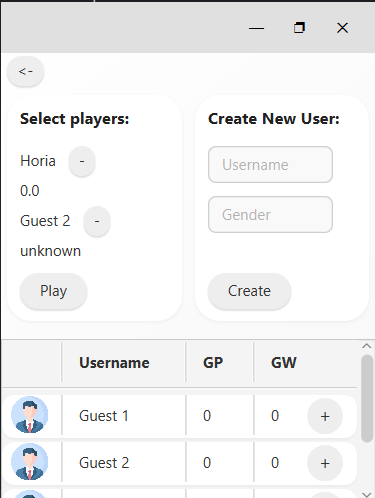
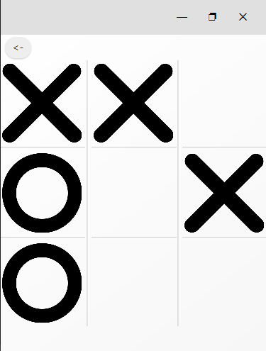

# Project Name

## Overview
A simple and clean JavaFX-based Tic Tac Toe (X & O) desktop app with a modern interface and basic user tracking.
## 📸 Screenshots

### Main Interface
<!-- Add your screenshot here using the following format: -->

<!-- You can place your screenshots in a 'screenshots' folder in your project root -->

### Player Selection Interface


### Feature Demonstration


## ✨ Key Features
- 🎨 Modern UI with styled buttons, cards, and subtle effects
- 👥 Player selection with support for creating custom users
- 🧠 Game logic with clean turn-based play and score tracking
- 📋 Scrollable user list with win/loss stats
- 🐛 Simple and clean architecture using FXML & JavaFX

## 🚀 Getting Started

### Prerequisites
- Java SDK 23
- JavaFX SDK 23.0.1
- IDE Intellij

---

## 📁 Project Structure
```
src/
└── com/core/
├── common/ # Shared utilities and configurations
│ ├── config/ # Game settings
│ ├── exception/ # Custom exceptions
│ └── util/ # File handling, validation, etc.
├── game/ # Game logic and engine
│ └── service/ # GameService interfaces and implementations
├── player/ # Player domain
│ ├── model/ # Player model class
│ └── service/ # PlayerService interfaces and implementations
└── ui/
├── controller/ # JavaFX controllers
│ ├── app/ # App-level controls
│ ├── game/ # Game panel logic
│ └── player/ # Player list and item controls
├── tools/ # Context/state handling
└── util/ # FXML loader abstraction

MainApp.java # Entry point
```

---

### 🌟 Planned Features

```markdown
## 🧠 Planned Features

- 🏆 **Leaderboard View**  
  View top players by games played, games won, or streaks.

- 🌓 **Theme Support**  
  Toggle between light/dark modes using JavaFX CSS themes.
  
- 🎨 **Custom Avatars**  
  Allow users to pick or upload their own profile images.
```

### 🙌 Credits
Created by Savin Horia Matei as a simple JavaFX GUI project.